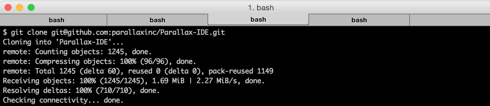
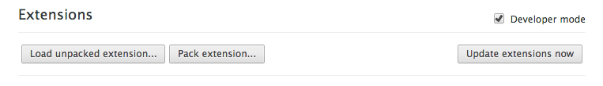
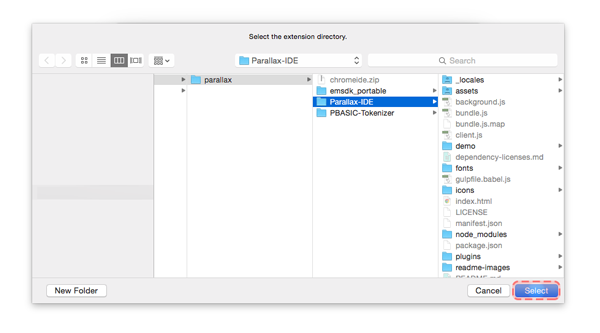
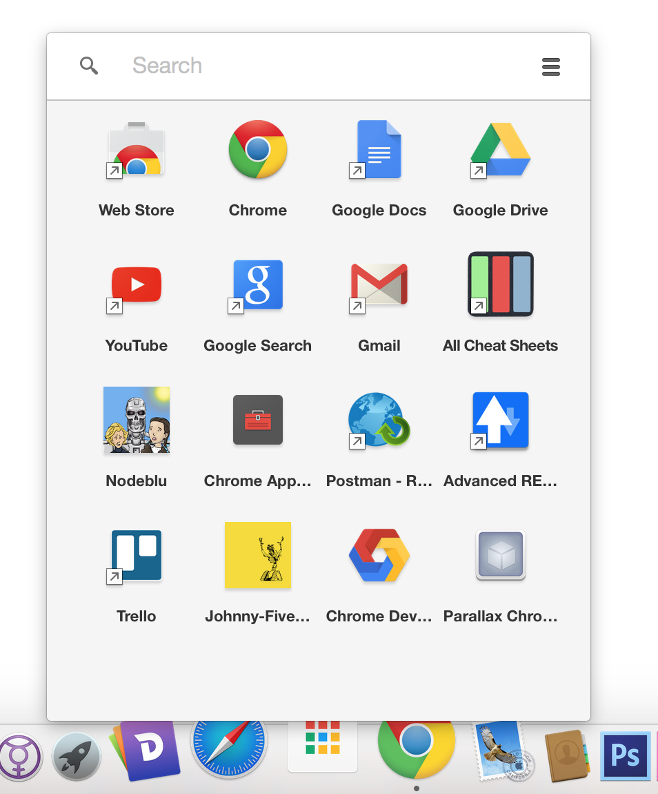

# Parallax IDE
Write, compile, and download code to your Parallax Boe-Bot Robot or custom BASIC Stamp microcontroller-based electronic creations.

## Quickstart

1. Visit our [github releases](https://github.com/parallaxinc/Parallax-IDE/releases) and download the desired release or download the latest release [here](https://github.com/parallaxinc/Parallax-IDE/releases/latest).

1. Go to your downloads folder and unzip the archive.

  _*Note:* for use on Chromebook you will need to unzip the archive and copy the unzipped directory onto the Chromebook._

1. Open Chrome and follow the [Installing in Chrome](https://github.com/parallaxinc/Parallax-IDE#user-content-installing-in-chrome) instructions.

## Building from Source/Developing

Most of below is a one-time procedure needed to build the application, unless otherwise noted.  To build the application you will need the node.js JavaScript runtime.  node.js itself comes bundled with the `npm` package manager. If you don't have it, then:

1. Install node.js by going to [nodejs.org/download](https://nodejs.org/download/) and selecting the option that is right for your system.

1. You also need all the dependencies for node-gyp, a tool that comes with node.js for compiling native addon modules.  The gyp project is used by the Chromium team makes it easier to build across platforms.

  Please visit the [node-gyp page](https://github.com/TooTallNate/node-gyp#installation) and note your system and the dependencies you will need.

  __* Note: that you do not need to install node-gyp, only its dependencies.__

1. Clone this respository.  Assuming you have `git` installed (if not, [go here](http://git-scm.com/book/en/v2/Getting-Started-Installing-Git)), choose your file destination from the command-line (CLI like Terminal), and

  ` git clone git@github.com:parallaxinc/Parallax-IDE `

  

1. Go to the project root directory with

  ` cd Parallax-IDE/ `

1. Get all the project dependencies.  At the root of the project you will find `package.json`.  This manifest file includes a list of project dependencies needed to build the application. To learn more, [see this post on dependency installation](https://github.com/iceddev/getting-started/blob/master/environments/nodejs-and-npm.md#user-content-dependency-installation). __This step must be run each time you update the repository (including pulling updates from GitHub).__

  To get dependencies, enter:

  ` npm install `
  
  _*Note:* To ensure all dependencies are updated, it's recommended to do the following_
  
  ``` 
  npm cache clean
  npm install
  ```

1. Build the application by entering. __This step must be run each time you update the repository (including pulling updates from GitHub).__

  `npm run build` or `npm run build -- --watch`*

  __* Note: using `--watch` will result in a rebuild of the application any time a file changes__


## Installing in Chrome

1. Open your Chrome browser and navigate to

  ` chrome://extensions `

1. Enable 'Developer Mode' by clicking the checkbox.

  

1. Before you install your extension must be built and bundled.  If you haven't done so follow the instructions in the [Build from Source](#user-content-build-from-source) section first.

1. Click on __'Load unpacked extensions...'__, go to the directory where Parallax IDE was built, highlight the *'Parallax-IDE'* folder and and click select.

	
	

1. Return to the ` chrome://extensions ` page and you should see __'Parallax IDE'__ listed in available extensions.

	
1. Ensure the checkbox is *'enabled'* and click __'launch'__.
1. __Congratulations!__ You just launched Parallax IDE which will look something like this:

	


## Coming Back

One you install the built application it is super easy to launch it again.  You can either:

* go to ` chrome:// extensions `, search through the list until you find *Parallax IDE* and then click `launch'

or

* go to chrome app launcher and click on/search for *Parallax IDE*

  

  

