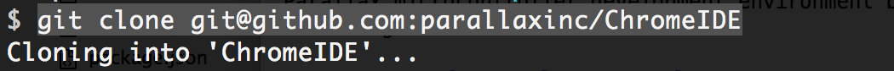
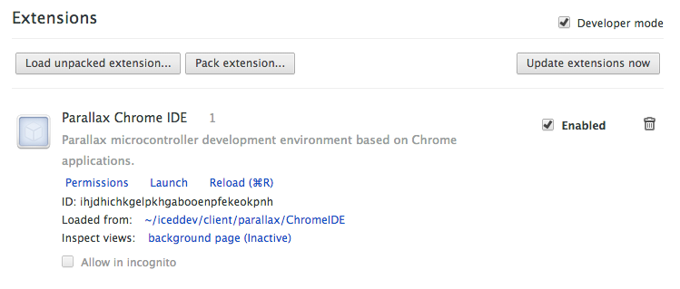
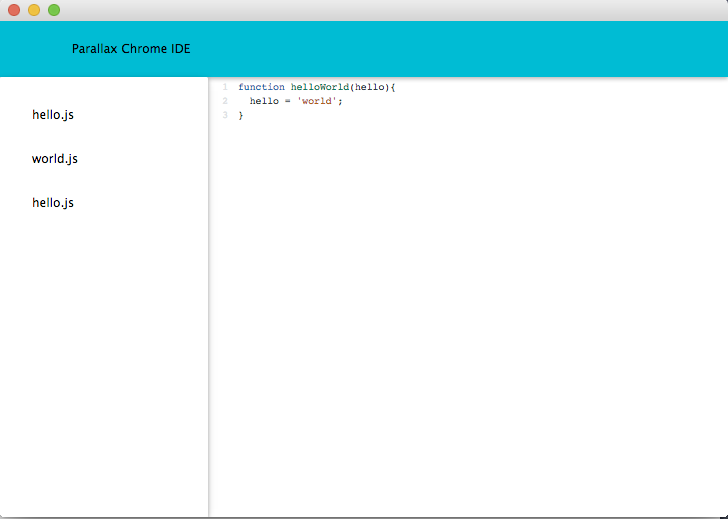

# ChromeIDE
Parallax microcontroller development environment based on Chrome application technologies.

## Getting Started

1. Clone this respository.  Choose your file destination from Terminal and

	``` git clone git@github.com:parallaxinc/ChromeIDE ```

	


2. Open your Chrome browser and navigate to

	``` chrome://extensions ```

3. Enable 'Developer Mode' by clicking the checkbox.

  

4. Click on __'Load unpacked extensions...'__, go to the directory where ChromeIDE was cloned, highlight the *'ChromeIDE'* folder and and click select.

	
	

5. Return to the ``` chrome://extensions ``` page and you should see __'Parallax Chrome IDE'__ listed in available extensions.

	
6. Ensure the checkbox is *'enabled'* and click __'launch'__.
7. __Congratulations!__ You just launched your chrome app which will look something like this:

	
